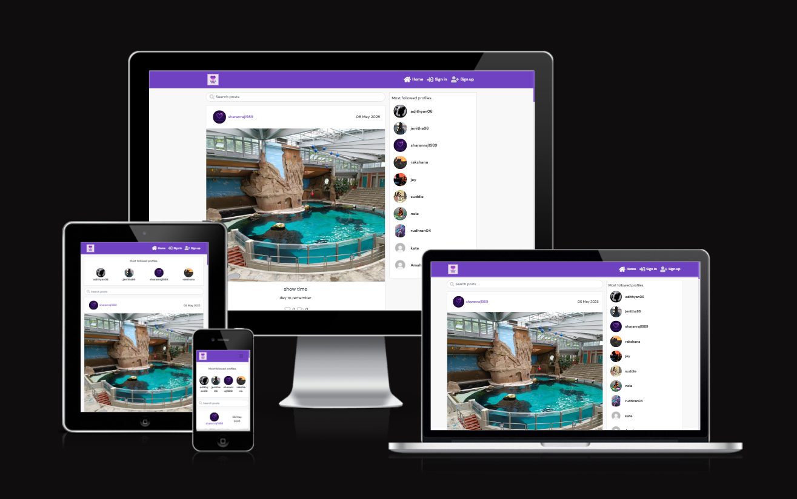

# 💜 Purple Vibes – Share Your World




**Purple Vibes** is a full-stack social web application where users can express themselves by sharing stories, images, and experiences. The platform is designed to encourage interaction, creativity, and community-building in a visually engaging and secure environment.

🎉 This project is my **final milestone submission** for the [Code Institute Full-Stack Developer Program](https://codeinstitute.net), built using the **MERN-adjacent stack** (React + Flask + MongoDB). It is a fully responsive, interactive app built with scalability and user engagement in mind.

🔗 **Live Site**: [Purple Vibes App](https://purple-vibes-frontend-c1ac08fd7889.herokuapp.com/)
📂 **Frontend GitHub Repo**: [Frontend Repo](https://github.com/sharanraj16/purple-vibes-frontend)
📂 **Backend GitHub Repo**: [Backend Repo](https://github.com/sharanraj16/purple-vibes-backend)

---

## 🌐 Project Overview

### 📌 What is Purple Vibes?

Purple Vibes allows users to:

* 📸 Share **posts** (text + optional image)
* 👍 React to others’ posts through **likes**
* 💬 **Comment** and engage in discussions
* 👥 **Follow** and connect with users
* 🔍 **Search** posts and users by keywords
* 🧑‍🎨 **Customize** their profiles
* 🛡️ Safely **sign up / log in / log out**

This platform blends **content creation, social interaction, and personalization** in one seamless UX-focused design.

---

## 🎯 Project Objectives

### 👥 **User Objectives**

Users want to:

* Share life moments and personal thoughts
* Discover content and users of similar interests
* Interact meaningfully via comments and reactions
* Control their own digital identity (profile, posts)
* Use the platform across devices (mobile/desktop)

### 👨‍💼 **Site Owner Objectives**

As the developer and site owner, I aim to:

* Deliver a **clean, responsive UI/UX**
* Implement **secure authentication** and role-based access
* **Boost user retention** through interactive features
* Enable **scalability** for future feature rollouts
* Offer **admin control**, logging, and activity tracking (future scope)

---

## 🧩 Features Breakdown

### ✅ Core Features (Implemented)

| Feature               | Description                                              |
| --------------------- | -------------------------------------------------------- |
| **User Auth**         | Secure signup/login using Flask-Login and JWT            |
| **Post Creation**     | Users can write and publish posts with optional images   |
| **Feed Display**      | Posts are displayed in reverse chronological order       |
| **Like System**       | Users can like/unlike posts (1 like per user)            |
| **Comment System**    | Add, delete, and view comments under posts               |
| **Follow System**     | Follow/unfollow users and view followed content          |
| **Profile Pages**     | Users can view and update their bio, avatar, and details |
| **Search**            | Search bar to find posts and users using keywords        |
| **Responsive Design** | Fully optimized for mobile, tablet, and desktop          |

### 🚧 Planned Features (Upcoming)

* 🔔 **Notifications** – Real-time alerts for likes, comments, follows
* 📩 **Private Messaging** – Direct chat between users
* 🔐 **Post Privacy Settings** – Choose public/private visibility
* 🏅 **Badges & Leaderboards** – Gamify user engagement
* 🛠️ **Admin Dashboard** – Content moderation and analytics

---

## 🗂️ Code Architecture

```
purple-vibes/
│
├── backend/
│   ├── app.py               # Flask app entry point
│   ├── routes/              # Blueprints: auth, posts, users
│   ├── models.py            # MongoDB data models
│   ├── schemas.py           # Marshmallow schemas for validation
│   ├── config.py            # Configs & env variables
│   └── tests/               # Pytest unit tests
│
├── frontend/
│   ├── public/              # Static assets
│   ├── src/
│   │   ├── components/      # React components (PostCard, NavBar, etc.)
│   │   ├── pages/           # Page-level views (Feed, Profile, Login)
│   │   ├── services/        # Axios API functions
│   │   ├── App.js           # Root component with routing
│   │   └── index.js         # React DOM render entry
│
├── .env                     # Environment variables
├── requirements.txt         # Python dependencies
└── package.json             # NPM dependencies
```

---

## ⚙️ Technologies Used

### 💻 Frontend

* **React.js**
* **React Router**
* **React Bootstrap**
* **Axios**
* **CSS Modules / Custom CSS**

### 🔧 Backend

* **Python 3**
* **Flask**
* **Flask-Login**
* **Flask-CORS**
* **Flask-MongoEngine**
* **JWT Authentication**

### 🗃️ Database

* **MongoDB** (NoSQL)
* **Cloud-hosted via MongoDB Atlas**

### ☁️ Deployment

* **Frontend**: Heroku + React Build
* **Backend**: Heroku Python App
* **Static Assets**: Cloudinary (for media storage)

### 🧪 Testing

* **Pytest** (backend)
* **React Testing Library** (planned)

 more about the testing process, [click here to see the TESTING documentation](TESTING.md).


---

## 🛠️ Installation & Local Setup

### ✅ Prerequisites

* Python 3.8+
* Node.js and npm
* MongoDB (Atlas or Local)
* Git

### 🔧 Backend Setup

```bash
git clone https://github.com/your-username/purple-vibes.git
cd purple-vibes/backend

# Create virtual env
python -m venv venv
source venv/bin/activate

# Install dependencies
pip install -r requirements.txt

# Set up .env file with:
SECRET_KEY='your-secret-key'
MONGO_URI='your-mongodb-uri'

# Run the app
python app.py
```

### 💻 Frontend Setup

```bash
cd ../frontend
npm install

# Start frontend
npm start
```

Visit: `http://localhost:3000`
Backend runs on: `http://localhost:5000`

---

## 🧪 Running Tests

### ✅ Backend Tests

```bash
cd backend
pytest
```

*Tests include:*

* Authentication flow
* CRUD operations
* Model validation

---

## 🗂️ GitHub Project Board

Project tasks, issues, and progress are tracked here:
🗂️ [Purple Vibes Project Board](https://github.com/your-username/purple-vibes/projects/1)

---

## 🤝 How to Contribute

We welcome all contributions! To contribute:

1. Fork this repository
2. Create a new branch (`git checkout -b feature-xyz`)
3. Commit your changes (`git commit -m 'Add new feature'`)
4. Push to your branch (`git push origin feature-xyz`)
5. Open a pull request

---

## 👏 Acknowledgments

Big thanks to:

* **Code Institute** – Curriculum & community
* **Mentor** – For feedback and direction
* **Jenitha (my wife)** – For endless support
* **Kelly Hutchison** – For encouragement
* **Sylveria Ozioma** – For insights and feedback

---

## 🚀 Final Thoughts

Creating **Purple Vibes** has been an eye-opening, transformative journey. It challenged me to think like a developer, act like a product designer, and test like a QA engineer. I’ve learned not only how to code, but how to build scalable, user-friendly web applications.

> “Great products begin with empathy, grow with effort, and thrive through community.”
> Thank you for visiting Purple Vibes 💜

---

Would you like this as a downloadable `.md` file or help embedding this directly into your GitHub project?
