# 💜 Purple Vibes – Share Your World

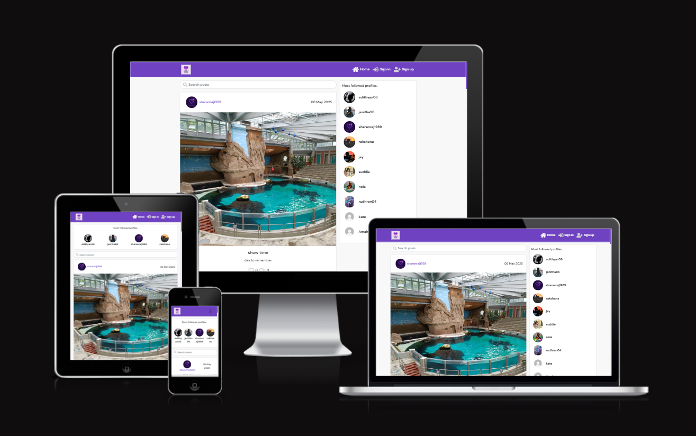


**Purple Vibes** is a full-stack social web application where users can express themselves by sharing stories, images, and experiences. The platform is designed to foster creativity, interaction, and community-building within a visually engaging and secure environment.

🎉 This project is my **final milestone submission (PP5)** for the Code Institute Full-Stack Developer Program. It is built using a MERN-adjacent stack (React + Flask + MongoDB) and is a fully responsive, interactive app designed with scalability and user engagement in mind.

Project by: Sharanraj Sivakumar

🔗 **Live Site**: [Purple Vibes App](https://purple-vibes-frontend-c1ac08fd7889.herokuapp.com/)
📂 **Frontend GitHub Repo**: [Frontend Repo](https://github.com/sharanraj16/purple-vibes-frontend)
📂 **Backend GitHub Repo**: [Backend Repo](https://github.com/sharanraj16/purple-vibes-backend)

---

## 🌐 Project Overview

### 📌 What is Purple Vibes?

Purple Vibes allows users to:

* 📸 Share **posts** (text + optional image)
* 👍 React to others’ posts through **likes**
* 💬 **Comment** and engage in discussions
* 👥 **Follow** and connect with users
* 🔍 **Search** posts and users by keywords
* 🧑‍🎨 **Customize** their profiles
* 🛡️ Safely **sign up / log in / log out**

This platform blends **content creation, social interaction, and personalization** in one seamless UX-focused design.

---
## color palette

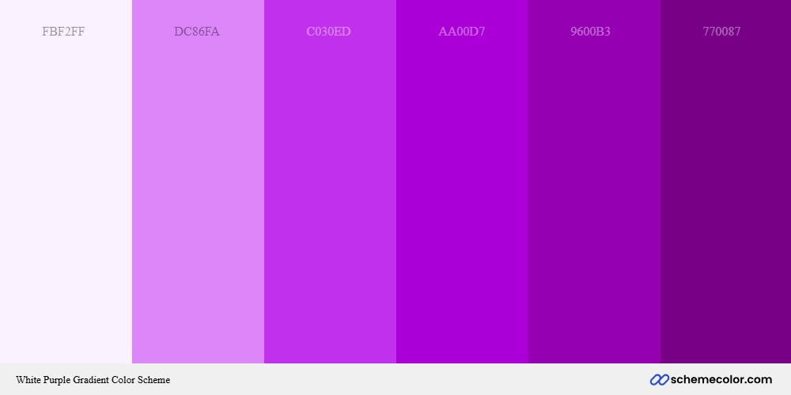
## 🖼️ Balsamiq Wireframes

The following wireframes were created in **Balsamiq** to guide the initial layout and functionality of Purple Vibes.

| Home Feed | Upload Detail | Login/Signup | Logout/Signout |

 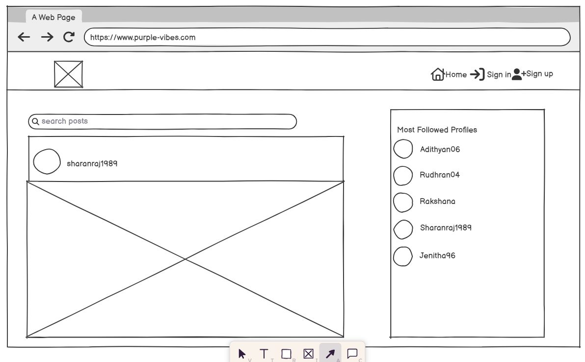  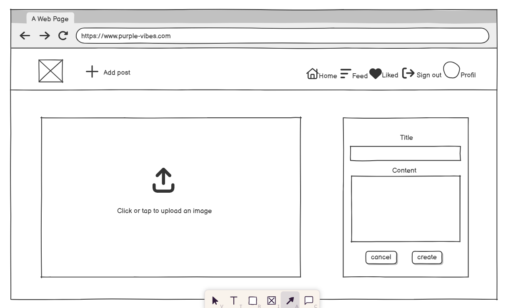  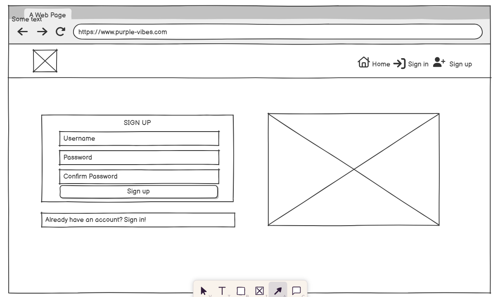  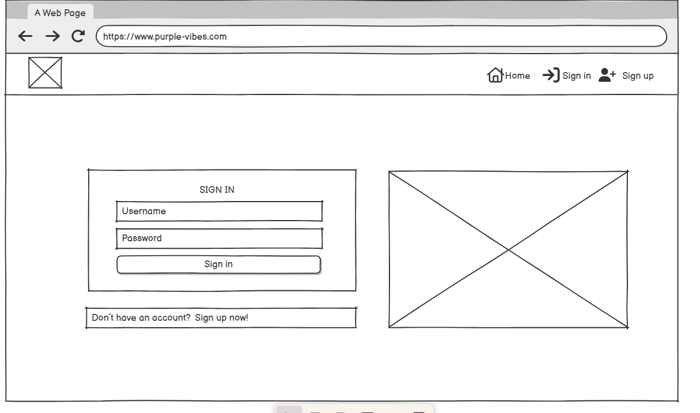 


## 🎯 Project Objectives

### 👥 **User Objectives**

Users want to:

* Share life moments and personal thoughts
* Discover content and users of similar interests
* Interact meaningfully via comments and reactions
* Control their own digital identity (profile, posts)
* Use the platform across devices (mobile/desktop)

### 👨‍💼 **Site Owner Objectives**

As the developer and site owner, I aim to:

* Deliver a **clean, responsive UI/UX**
* Implement **secure authentication** and role-based access
* **Boost user retention** through interactive features
* Enable **scalability** for future feature rollouts
* Offer **admin control**, logging, and activity tracking (future scope)
---
Tools Used For Agile development
GitHub Projects for tracking sprints and issues

GitHub Issues for writing user stories with clear acceptance criteria

Commits linked to issues for traceability and progress updates

The project board can be found here

Back to Top
---
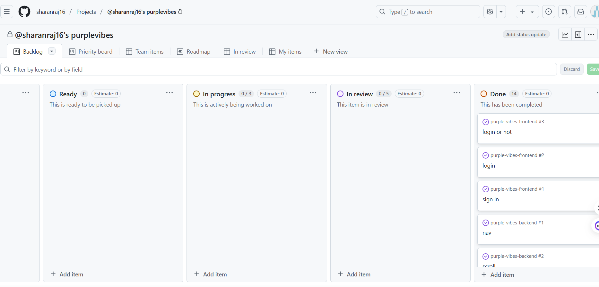

---
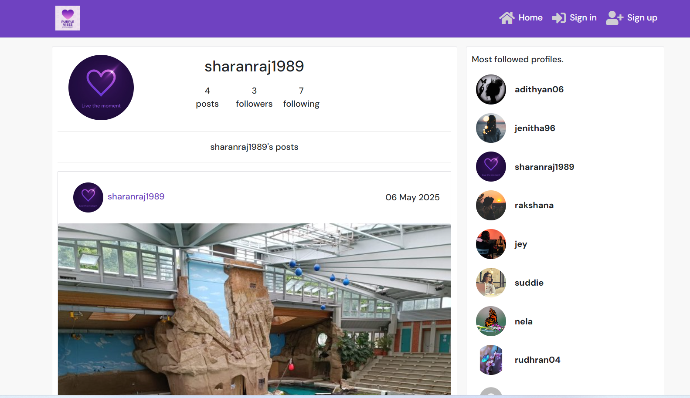

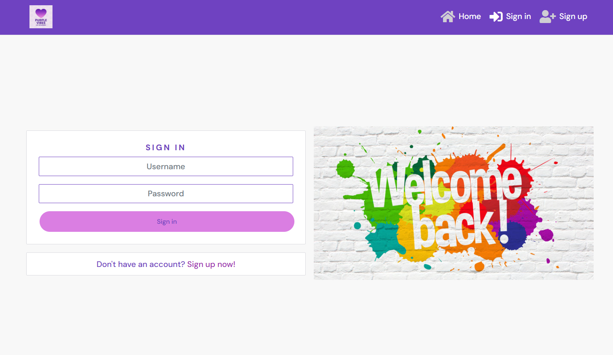

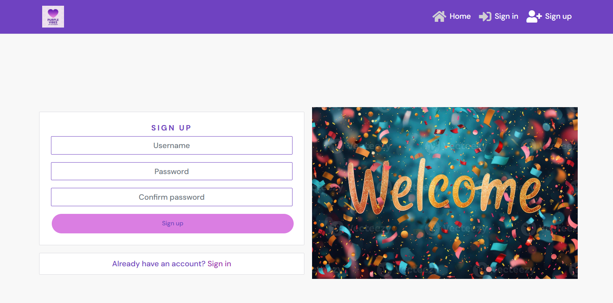

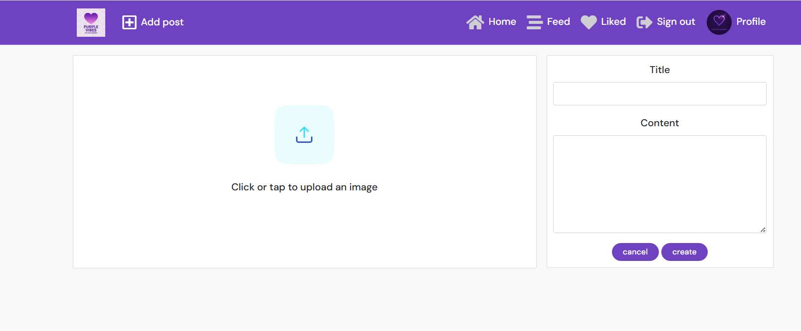


## 🧩 Features Breakdown

### ✅ Core Features (Implemented)

| Feature               | Description                                              |
| --------------------- | -------------------------------------------------------- |
| **User Auth**         | Secure signup/login using Flask-Login and JWT            |
| **Post Creation**     | Users can write and publish posts with optional images   |
| **Feed Display**      | Posts are displayed in reverse chronological order       |
| **Like System**       | Users can like/unlike posts (1 like per user)            |
| **Comment System**    | Add, delete, and view comments under posts               |
| **Follow System**     | Follow/unfollow users and view followed content          |
| **Profile Pages**     | Users can view and update their bio, avatar, and details |
| **Search**            | Search bar to find posts and users using keywords        |
| **Responsive Design** | Fully optimized for mobile, tablet, and desktop          |

### 🚧 Planned Features (Upcoming)

* 🔔 **Notifications** – Real-time alerts for likes, comments, follows
* 📩 **Private Messaging** – Direct chat between users
* 🔐 **Post Privacy Settings** – Choose public/private visibility
* 🏅 **Badges & Leaderboards** – Gamify user engagement
* 🛠️ **Admin Dashboard** – Content moderation and analytics

---

## 🗂️ Code Architecture

```
purple-vibes/
│
├── backend/
│   ├── app.py               # Flask app entry point
│   ├── routes/              # Blueprints: auth, posts, users
│   ├── models.py            # MongoDB data models
│   ├── schemas.py           # Marshmallow schemas for validation
│   ├── config.py            # Configs & env variables
│   └── tests/               # Pytest unit tests
│
├── frontend/
│   ├── public/              # Static assets
│   ├── src/
│   │   ├── components/      # React components (PostCard, NavBar, etc.)
│   │   ├── pages/           # Page-level views (Feed, Profile, Login)
│   │   ├── services/        # Axios API functions
│   │   ├── App.js           # Root component with routing
│   │   └── index.js         # React DOM render entry
│
├── .env                     # Environment variables
├── requirements.txt         # Python dependencies
└── package.json             # NPM dependencies
```

---

## ⚙️ Technologies Used

### 💻 Frontend

* **React.js**
* **React Router**
* **React Bootstrap**
* **Axios**
* **CSS Modules / Custom CSS**

### 🔧 Backend

* **Python 3**
* **Flask**
* **Flask-Login**
* **Flask-CORS**
* **Flask-MongoEngine**
* **JWT Authentication**

### 🗃️ Database

* **MongoDB** (NoSQL)
* **Cloud-hosted via MongoDB Atlas**

### ☁️ Deployment

* **Frontend**: Heroku + React Build
* **Backend**: Heroku Python App
* **Static Assets**: Cloudinary (for media storage)

### 🧪 Testing

* **Pytest** (backend)
* **React Testing Library** (planned)

 more about the testing process, [click here to see the TESTING documentation](TESTING.md).


---

## 🛠️ Installation & Local Setup

### ✅ Prerequisites

* Python 3.8+
* Node.js and npm
* MongoDB (Atlas or Local)
* Git

### 🔧 Backend Setup

```bash
git clone https://github.com/your-username/purple-vibes.git
cd purple-vibes/backend

# Create virtual env
python -m venv venv
source venv/bin/activate

# Install dependencies
pip install -r requirements.txt

# Set up .env file with:
SECRET_KEY='your-secret-key'
MONGO_URI='your-mongodb-uri'

# Run the app
python app.py
```

### 💻 Frontend Setup

```bash
cd ../frontend
npm install

# Start frontend
npm start
```

Visit: `http://localhost:3000`
Backend runs on: `http://localhost:5000`

---

## 🧪 Running Tests

### ✅ Backend Tests

```bash
cd backend
pytest
```

*Tests include:*

* Authentication flow
* CRUD operations
* Model validation

---

## 🗂️ GitHub Project Board

Project tasks, issues, and progress are tracked here:
🗂️ [Purple Vibes Project Board](https://github.com/your-username/purple-vibes/projects/1)

---
🚀 Deployment Guide

This section explains the deployment process for the Purple Vibes Frontend and Backend API, including cloning repositories, pushing code to GitHub, and deploying both apps to Heroku.

🔹 Cloning the Repositories from GitHub

To work locally on the project, start by cloning the repositories:

Frontend repo:

git clone https://github.com/sharanraj16/purple-vibes-frontend.git


Backend repo:

git clone https://github.com/sharanraj16/purple-vibes-backend.git

🔹 Pushing Frontend and Backend to GitHub

Step 1: Initialize Git (if not already done):

git init


Step 2: Stage all changes:

git add .


Step 3: Commit your changes:

git commit -m "Initial commit for Purple Vibes"


Step 4: Create repositories on GitHub:

Frontend repo: purple-vibes-frontend

Backend repo: purple-vibes-backend

Create new repositories at 👉 https://github.com/new
.

Step 5: Link local projects to GitHub repos (replace username with yours):

Frontend:

git remote add origin https://github.com/<username>/purple-vibes-frontend.git
git push -u origin main


Backend:

git remote add origin https://github.com/<username>/purple-vibes-backend.git
git push -u origin main

🔹 Deploying Backend API to Heroku (Django)

Step 1: Log in to Heroku CLI

heroku login


Step 2: Create a new Heroku app

heroku create purple-vibes-backend


Step 3: Connect GitHub repo to Heroku

Go to Heroku Dashboard → Deploy tab.

Choose GitHub → Connect to your purple-vibes-backend repo.

Enable Automatic Deploys from main.

Step 4: Configure environment variables (Heroku → Settings → Config Vars):

SECRET_KEY = your-django-secret-key

DEBUG = False

ALLOWED_HOSTS = purple-vibes-backend.herokuapp.com

CLOUDINARY_URL = your-cloudinary-api-url

Step 5: Run migrations and collect static files

heroku run python manage.py migrate -a purple-vibes-backend
heroku run python manage.py collectstatic --noinput -a purple-vibes-backend


✅ Your backend is now live at:
👉 https://purple-vibes-backend.herokuapp.com/

🔹 Deploying Frontend to Heroku (React)

Step 1: Prepare frontend for Heroku
In your frontend project, install a static server:

npm install serve


Update package.json scripts:

"scripts": {
  "start": "serve -s build",
  "build": "react-scripts build"
}


Create a Procfile in the frontend root:

web: npm run start


Step 2: Push frontend code to GitHub

git add .
git commit -m "Frontend ready for deployment"
git push origin main


Step 3: Deploy frontend via Heroku GitHub integration

Create a new Heroku app: purple-vibes-frontend

Go to Heroku Dashboard → Deploy tab

Connect GitHub repo purple-vibes-frontend

Enable Automatic Deploys from main

✅ Your frontend is now live at:
👉 https://purple-vibes-frontend.herokuapp.com/

🔹 Connecting Frontend to Backend

To make API calls from the frontend, set your backend base URL in React:

In .env (frontend project):

REACT_APP_API_URL=https://purple-vibes-backend.herokuapp.com/


Use it in your code:

const apiUrl = process.env.REACT_APP_API_URL;

🎯 Final Setup

Backend API → https://purple-vibes-backend.herokuapp.com/

Frontend App → https://purple-vibes-frontend.herokuapp.com/


# Improvements and Issue Resolutions

This project has undergone a thorough review and improvement process based on detailed feedback received during the initial assessment. I am pleased to confirm that all issues previously marked as "No" have been fully addressed and rectified in the current version of the project. The key enhancements include:

### Improved Post Editing Experience:
The post editing functionality has been improved so that users no longer need to re-upload images if no changes are made. Existing images are preloaded and persist unless explicitly updated by the user.

### Detailed Deployment Instructions:
The deployment documentation now contains comprehensive, step-by-step instructions for setting up, configuring, and deploying both the front-end React application and the back-end Django REST API on Heroku, including repository cloning and environment configuration.

### Design Documentation Added:
Wireframes, mockups, and design rationale have been added, outlining the user experience improvements and front-end architecture.

### Custom Backend Models:
All core backend models (Post, Profile, Comment, Follower, Like) have been updated with small, safe enhancements that provide scope for future customization. Examples include snippet previews, status checks, convenience methods, and helper functions that make the backend more maintainable and extendable without affecting frontend functionality.

---

## 👏 Acknowledgments

Big thanks to:

- **Code Institute** – Curriculum & community  
- **Mentor** – For feedback and direction  
- **Jenitha** – For endless support  
- **Kelly Hutchison** – For encouragement  
- **Sylveria Ozioma** – For insights and feedback  

---

## 🚀 Final Thoughts

Creating **Purple Vibes** has been an eye-opening, transformative journey. It challenged me to think like a developer, act like a product designer, and test like a QA engineer. I’ve learned not only how to code, but how to build scalable, user-friendly web applications.

 “Great products begin with empathy, grow with effort, and thrive through community.”  
 # Thank you for visiting Purple Vibes 💜

---


